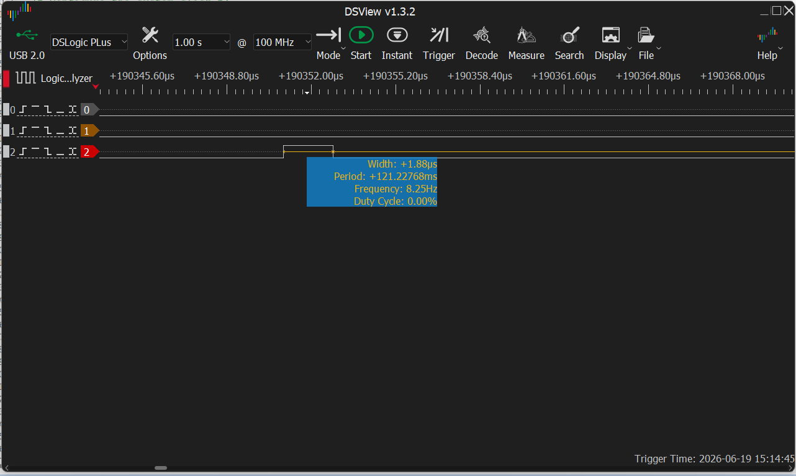
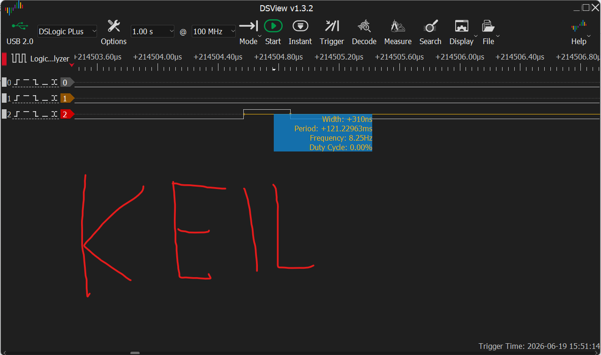
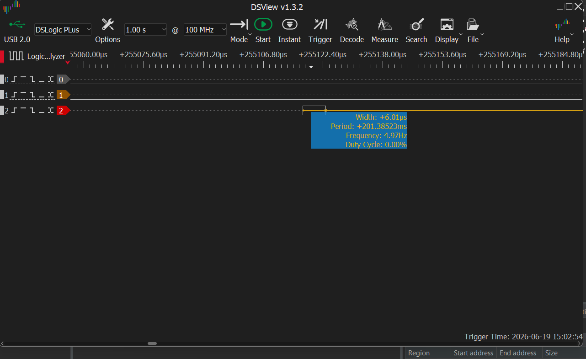
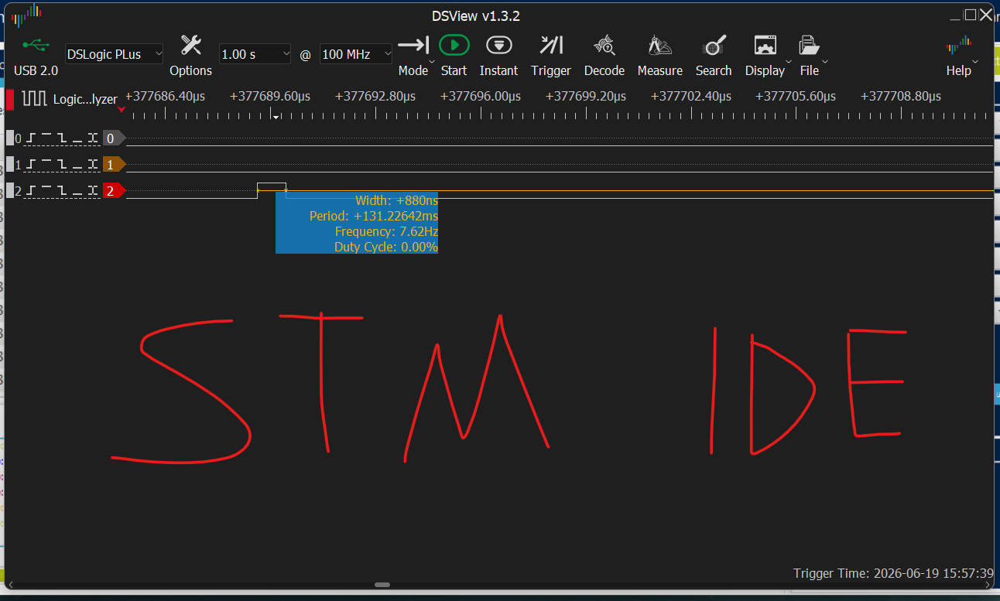
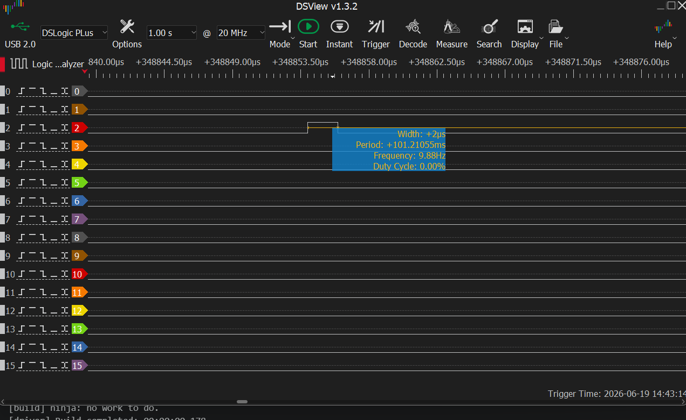
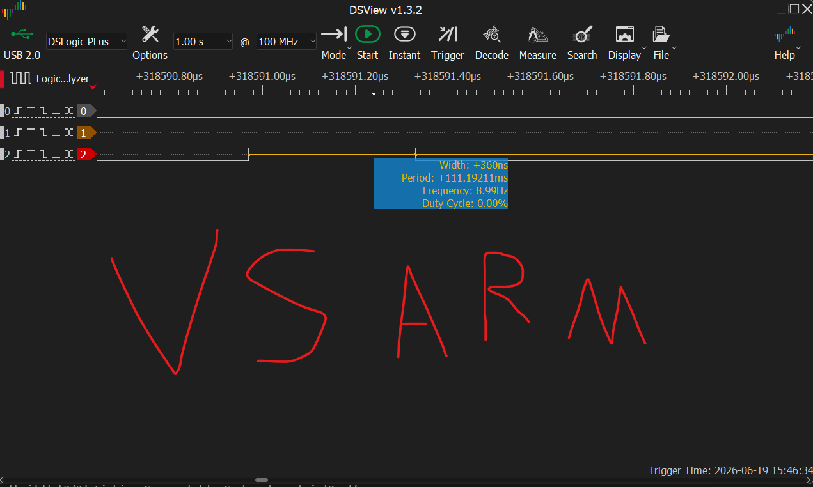
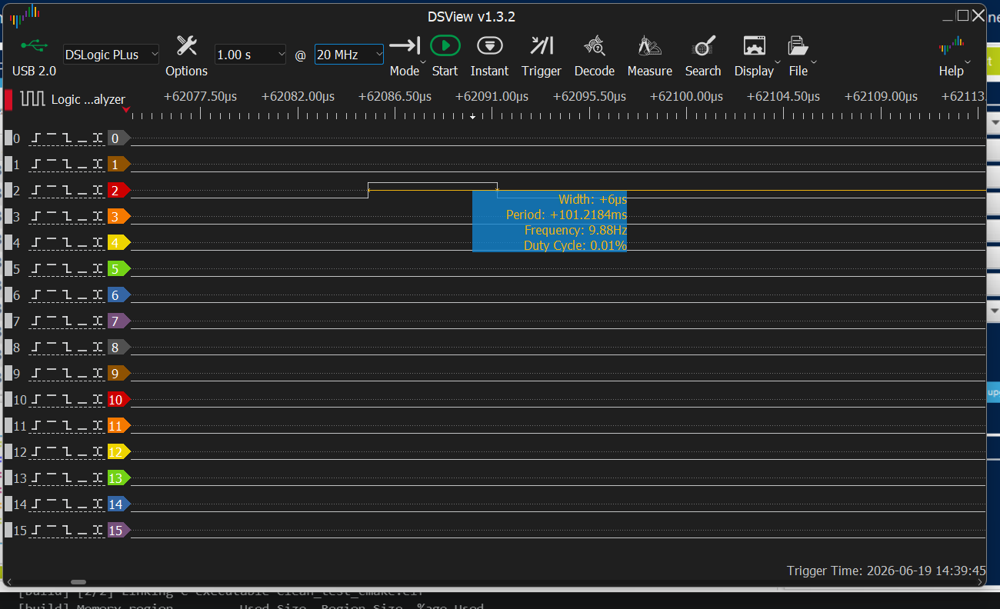
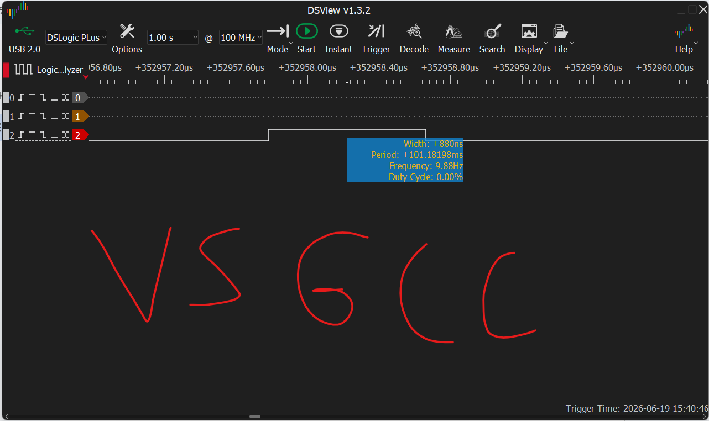

# IDE & Toolchain Efficiency Benchmarking Report

> **GPIO Toggle Time Analysis — Clock Scaling Study (8 MHz vs 64 MHz)**
> Revision 3 | June 19, 2026

| | |
|---|---|
| **Platform** | STM32 / ARM Cortex-M |
| **Measurement Tool** | DSLogic PLus @ 100 MHz |
| **Software** | DSView v1.3.2 |

---

## Table of Contents

1. [Executive Summary](#1-executive-summary)
2. [Test Configuration](#2-test-configuration)
3. [Benchmark Results](#3-benchmark-results)
4. [DSView Capture Evidence](#4-dsview-capture-evidence-64-mhz-hclk)
5. [Clock Speed vs Switching Time — Correlation Analysis](#5-clock-speed-vs-switching-time--correlation-analysis)
6. [Recommendations](#6-recommendations)
7. [Conclusion](#7-conclusion)

---

## 1. Executive Summary

This report evaluates GPIO toggle switching time across four IDE/toolchain configurations at two HCLK frequencies: **8 MHz** and **64 MHz**. All 64 MHz measurements are corroborated by DSView v1.3.2 logic analyzer captures (DSLogic PLus, sampled at 100 MHz), included in Section 4 as primary evidence.

### Key Findings

| Rank | IDE / Toolchain | 8 MHz | 64 MHz |
|------|----------------|-------|--------|
| 🥇 1st | **KEIL uVision 5** | 1.88 µs | 310 ns |
| 🥈 2nd | **ARM Clang (VS Studio)** | 2.00 µs | 360 ns |
| 🥉 3rd | **STM32CubeIDE** | 6.00 µs | 880 ns |
| 3rd | **GCC Toolchain (VS Studio)** | 6.00 µs | 880 ns |

> **Clock scaling is sub-linear:** an 8× clock increase yields only a 5.56×–6.82× speedup, revealing fixed non-scalable overhead in all toolchains.

---

## 2. Test Configuration

### 2.1 Hardware & Measurement Setup

| Parameter | Value |
|-----------|-------|
| Microcontroller | STM32 (ARM Cortex-M series) |
| Clock Run 1 (HCLK) | 8 MHz |
| Clock Run 2 (HCLK) | 64 MHz |
| GPIO Port / Pin | GPIOA, PIN_14 |
| Logic Analyzer | DSLogic PLus (USB 2.0) |
| Analyzer Software | DSView v1.3.2 |
| Sample Rate | 100 MHz |
| HAL Library | STM32 HAL (`stm32fxxx_hal_gpio`) |
| Delay Range | `HAL_Delay(100–200)` |

### 2.2 Benchmark Code

The following code was used identically across all configurations:

```c
HAL_GPIO_TogglePin(GPIOA, GPIO_PIN_14);
HAL_GPIO_TogglePin(GPIOA, GPIO_PIN_14);
HAL_Delay(100–200);   // variable delay interval
```

The double-toggle pattern generates a measurable pulse on Channel 2 of the logic analyzer. The pulse width reported by DSView (shown in Section 4) is the direct measurement of GPIO switching time.

---

## 3. Benchmark Results

### 3.1 Combined Results Table

| Rank | IDE / Toolchain | 8 MHz | 64 MHz | Speedup | Evidence |
|------|----------------|-------|--------|---------|----------|
| 🥇 1 | KEIL uVision 5 | **1.88 µs** | **310 ns** | 6.06× | DSView — Figure 3 |
| 🥈 2 | ARM Clang (VS Studio) | **2.00 µs** | **360 ns** | 5.56× | DSView — Figure 5 |
| 🥉 3 | STM32CubeIDE | **6.00 µs** | **880 ns** | 6.82× | DSView — Figure 4 |
| 3 | GCC Toolchain (VS Studio) | **6.00 µs** | **880 ns** | 6.82× | DSView — Figure 6 |

### 3.2 Side-by-Side Bar Chart: 8 MHz vs 64 MHz

*Figure 1 — GPIO Toggle Switching Time by IDE/Toolchain at 8 MHz and 64 MHz (lower = better)*

### 3.3 Clock Scaling Efficiency Chart

*Figure 2 — Observed speedup vs. theoretical 8× linear scaling (dashed orange line)*

---

## 4. DSView Capture Evidence (64 MHz HCLK)

The following DSView v1.3.2 screenshots were captured using a DSLogic PLus logic analyzer sampled at 100 MHz. Channel 2 in each capture shows the GPIO toggle pulse generated by the double `HAL_GPIO_TogglePin()` call. The **Width** value displayed in the measurement tooltip is the primary data point for each toolchain at 64 MHz.

---

### Figure 3 — KEIL uVision 5 @ 64 MHz

| 8 MHz | 64 MHz |
|-------|--------|
|  |  |

**Measured Width: `+310 ns`**

> KEIL uVision 5: GPIO toggle pulse width = 310 ns @ 64 MHz HCLK.
> Period: 121.23 ms | Frequency: 8.25 Hz

---

### Figure 4 — STM32CubeIDE @ 64 MHz

| 8 MHz | 64 MHz |
|-------|--------|
|  |  |

**Measured Width: `+880 ns`**

> STM32CubeIDE: GPIO toggle pulse width = 880 ns @ 64 MHz HCLK.
> Period: 131.23 ms | Frequency: 7.62 Hz

---

### Figure 5 — ARM Clang / VS Studio @ 64 MHz

| 8 MHz | 64 MHz |
|-------|--------|
|  |  |

**Measured Width: `+360 ns`**

> ARM Clang (VS Studio): GPIO toggle pulse width = 360 ns @ 64 MHz HCLK.
> Period: 111.19 ms | Frequency: 8.99 Hz

---

### Figure 6 — GCC Toolchain / VS Studio @ 64 MHz

| 8 MHz | 64 MHz |
|-------|--------|
|  |  |

**Measured Width: `+880 ns`**

> GCC Toolchain (VS Studio): GPIO toggle pulse width = 880 ns @ 64 MHz HCLK.
> Period: 101.18 ms | Frequency: 9.88 Hz

---

## 5. Clock Speed vs Switching Time — Correlation Analysis

### 5.1 Theoretical Expectation

A perfectly clock-cycle-bound operation would scale exactly with clock frequency. An 8× HCLK increase (8 MHz → 64 MHz) should yield an **8× reduction** in switching time. The gap between the theoretical 8× and the observed ratios quantifies the fixed non-scalable overhead present in each toolchain.

### 5.2 Scaling Analysis Table

| IDE / Toolchain | 8 MHz (ns) | 64 MHz (ns) | Observed × | Theoretical × | Scaling Eff. |
|----------------|-----------|------------|------------|---------------|--------------|
| KEIL uVision 5 | 1880 | 310 | **6.06×** | 8.00× | **75.8%** |
| ARM Clang (VS Studio) | 2000 | 360 | **5.56×** | 8.00× | **69.4%** |
| STM32CubeIDE | 6000 | 880 | **6.82×** | 8.00× | **85.2%** |
| GCC Toolchain (VS Studio) | 6000 | 880 | **6.82×** | 8.00× | **85.2%** |

### 5.3 Key Correlation Findings

**Sub-linear scaling across all toolchains.**
No toolchain reaches the theoretical 8×. Speedups of 5.56×–6.82× confirm that 12.5%–30.6% of latency is non-clock-scalable overhead (bus pipeline, flash wait states, HAL dispatch cost).

**GCC/STM32 scale better (85.2%) but remain slower in absolute terms.**
Their slower 8 MHz baseline is more purely instruction-count-driven, so they benefit proportionally more from the clock increase.

**ARM Clang shows lowest scaling efficiency (69.4%).**
Its tightly optimized code has a higher proportion of fixed-overhead instructions (function prologue, AHB access latency) that do not benefit from clock scaling.

**Rankings are stable across both clock speeds.**
KEIL > ARM Clang > STM32CubeIDE = GCC at both 8 MHz and 64 MHz, confirming that code generation quality is the dominant, clock-independent differentiator.

---

## 6. Recommendations

- **Latency-critical applications:** Use KEIL uVision 5 or ARM Clang — both deliver sub-400 ns at 64 MHz, confirmed by DSView measurements.

- **STM32CubeIDE / GCC users:** Enable `-O2` or `-O3` + LTO to reduce instruction-count overhead and improve clock scaling efficiency toward the ARM Clang level.

- **Hardware optimisation:** Enable the STM32 instruction cache (`ICACHE`/`PREFETCH`) at 64 MHz to reduce flash wait-state overhead and push scaling efficiency closer to the theoretical 8×.

- **Extended benchmarking:** Extend the benchmark to higher clock speeds (72 MHz, 120 MHz, 168 MHz) and additional GPIO operations to characterise the full latency-vs-frequency curve.

- **HAL overhead isolation:** Benchmark direct register access (`GPIOA->ODR ^= PIN_14`) in parallel to isolate HAL call overhead from the underlying hardware switching time.

---

## 7. Conclusion

Verified by DSLogic PLus captures in DSView v1.3.2, this report confirms that **KEIL uVision 5 (310 ns)** and **ARM Clang (360 ns)** significantly outperform STM32CubeIDE and GCC toolchain (both 880 ns) at 64 MHz HCLK for HAL GPIO toggle operations.

The observed 5.56×–6.82× speedup from an 8× clock increase reveals measurable non-scalable overhead in all configurations, with GCC-based tools showing better relative scaling efficiency despite their larger absolute latency.

**KEIL uVision 5 remains the recommended toolchain** for time-critical embedded GPIO operations at both tested clock frequencies.

---

*IDE & Toolchain Efficiency Benchmarking Report | Rev 3 | June 19, 2026 | STM32 / ARM Cortex-M*
